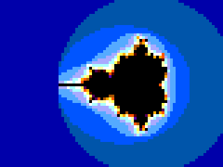
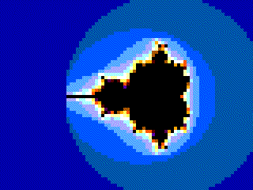
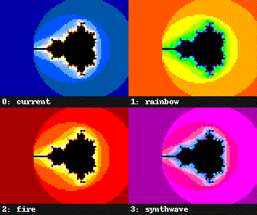

## How it works

The design draws the Mandelbrot set on a 640×480 VGA monitor and animates it
by shifting the colour bands. Everything fits in one tile, with no frame
buffer: every pixel is recomputed while the beam draws it, 60 times a second.

**Beam racing.** The screen is divided into 80×60 blocks of 8×8 pixels. The
clock runs at 50.35 MHz, twice the VGA pixel clock, so one block lasts 16
clocks. A single iteration unit uses those 16 clocks to run 16 iterations of
z ← z² + c for the *next* block, then hands the result (escaped or not, and
the escape iteration) to a 5-bit display register. Block 0 of each line is
computed during horizontal blanking.

**The point c** comes straight from the VGA counters:
c = (−3.25 + col/16) + i(1.875 − row/16).

**Arithmetic.** Q3.6 signed fixed point (9 bits, range [−4, 4)):

- x², y² and 2xy come from three 7×7 multipliers on the magnitudes |x|, |y|.
  Products are only needed while |x|, |y| < 2, so 7 bits suffice. The sign of
  2xy is applied by adding or subtracting it from ci.
- A point escapes when |x| ≥ 2, |y| ≥ 2 or x² + y² > 4. An update that
  overflows the range also counts as an escape (it implies |z| > 2), so no
  saturation logic is needed.

**Colour.** Each block's escape iteration n selects a colour from a 16-entry,
2-bit-per-channel palette: palette[(n + phase) mod 16]. Points inside the set
are black. A frame counter advances `phase`, so the bands flow outward or
inward. The palette is a closed loop with no black entry (navy → white →
yellow → orange → maroon → purple), so a band never merges with the set.

**Palettes.** `ui[5:4]` selects one of four 16-colour palettes, latched once
per frame so a change never tears the picture. Closed-loop palettes (current,
rainbow, synthwave) make the bands flow; the fire palette ramps dark → white →
dark, so its bands pulse.

## How to test

1. Plug a [TinyVGA PMOD](https://github.com/mole99/tiny-vga) into the output
   PMOD (`uo_out`), and connect a VGA monitor.
2. Set the project clock to **50.35 MHz** (2× the 25.175 MHz pixel clock).
   Most monitors also accept 50 MHz.
3. Release reset. The Mandelbrot set appears with the colour bands moving.

| Input | Function |
|---|---|
| `ui[1:0]` | cycle speed: the colours step every 1, 2, 4 or 8 frames |
| `ui[2]` | direction: 0 = forward, 1 = reverse |
| `ui[3]` | pause |
| `ui[5:4]` | palette: 0 = current, 1 = rainbow, 2 = fire, 3 = synthwave |

The cocotb test (`test/`) captures complete frames from the VGA pins. It
checks every pixel against a bit-level model (`test/model.py`), and checks
that the colour phase steps correctly for forward, reverse, pause and speed.

## External hardware

- TinyVGA PMOD (2 bits per colour channel) on the output PMOD
- VGA monitor
